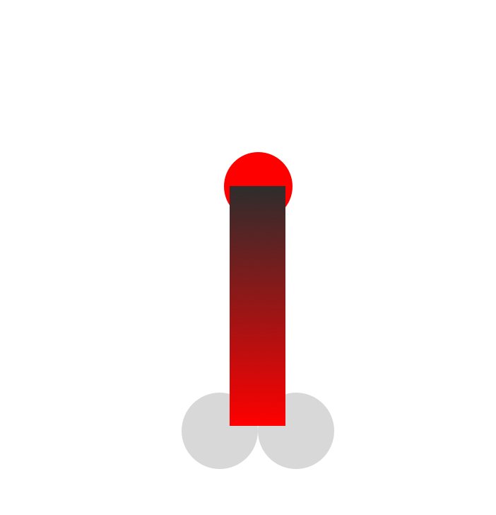

# Artboards

This is an autogenerated file showing all the artboards. Do not edit it directly.

## Accordion

## Artboard

## Border

## Buttons

## Color

## Dropdown

## Form_Elements

## Header

## Icons

## Imagecontainer

## Layerstyles - Shadows

## Line

## Links

## MQ1

## MQ2

## MQ5

## MQ6

## Measurements Dropdown

## Measurements Input

## Measurements Tabs MQ3-6

## Slider

## Tabs

## Text Styles

## Toggle

## Tooltip

## _Margin

## _Measurements

## zzz_OLD

